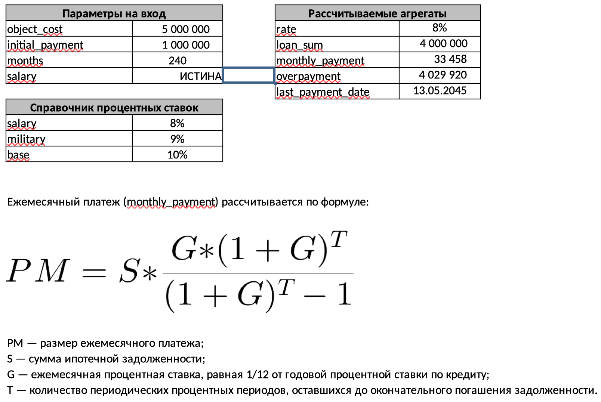

# структура
```
ipocalc/
├── cmd/
│   └── server/
│       └── main.go             # точка входа в приложение
├── internal/
│   ├── handlers/               # HTTP-обработчики
│   │   └── handlers.go
│   ├── services/               # бизнес-логика, расчет ипотеки
│   │   └── mortgage.go
│   ├── cache/                  # кэш в памяти
│   │   └── cache.go
│   └── models/                 # модели данных
│       └── models.go
├── configs/
│   └── config.yml              # конфигурационный файл
├── scripts/                      # скрипты для сборки/развертывания
│   └── ...
├── test/                         # тестовые файлы и тесты
│   └── handlers_test.go
├── Dockerfile
├── Makefile
├── go.mod
├── go.sum
└── README.md
```

## CACHE 
sync MAP (время истечения срока действия элементов и интервал очистки)
```
cacheStore := cachemod.NewContainer(5*time.Minute, 10*time.Minute)
```


## CALCULATOR
```

```


## HTTPSERVER
```
net/http
(w http.ResponseWriter, r *http.Request)

```

## TEST

```
тесты handlers
```

## LINTER
```
`golangci-lint`
```

## LOGGING
middleware, который будет выводить в консоль информацию о запросе:
```

   - `status_code` - http код запроса
   - `duration` - время работы эндпоинта (ns)

   2022/02/17 19:26:52 status_code: 200, duration: 243042 ns
   2022/02/17 19:26:53 status_code: 400, duration: 18875 ns
```

## MAKEFILE
```

build:
	@echo "Сборка бинарного файла..."

test:
	@echo "Запуск тестов..."

docker-build:
	@echo "Сборка Docker-образа..."

docker-run:
	@echo "Запуск Docker-контейнера..."

docker-stop:
	@echo "Остановка всех работающих контейнеров..."

clean:
	@echo "Очистка..."

lint:
	golangci-lint run

```